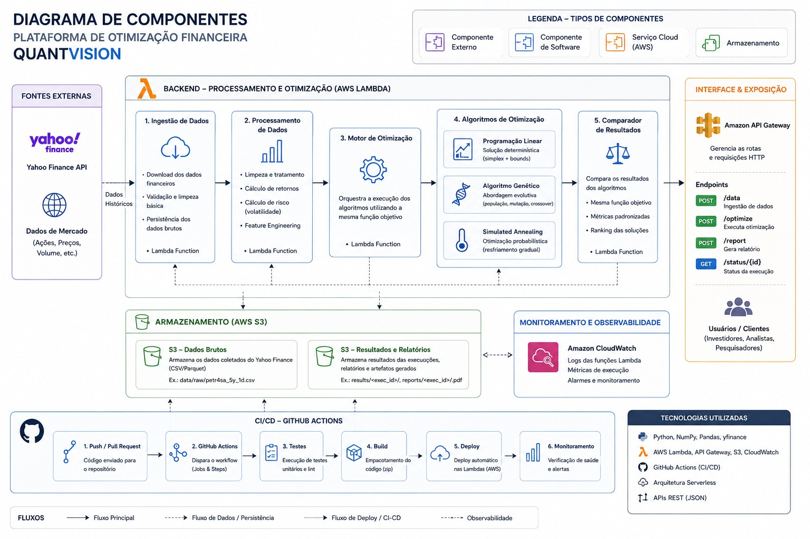

# QuantVision / Otimizador


**QuantVision** é uma plataforma serverless para otimização de carteiras financeiras. A aplicação coleta dados históricos, calcula métricas de risco/retorno, executa três algoritmos matemáticos e expõe os resultados por API na AWS.

> Projeto educacional e experimental. Não representa recomendação de investimento.

---

## Sumário

- [Visão geral](#visão-geral)
- [Arquitetura](#arquitetura)
- [API](#api)
- [Algoritmos](#algoritmos)
- [AWS](#aws)
- [Estrutura](#estrutura)
- [CI/CD e qualidade](#cicd-e-qualidade)
- [Roadmap](#roadmap)

---

## Visão geral

O sistema executa uma cadeia de análise quantitativa:

```text
Yahoo Finance → Ingestão → Features → Otimização → Comparação → S3/API
```

Principais capacidades:

- coleta de dados financeiros via Yahoo Finance;
- cálculo de retornos, risco, volatilidade e covariância;
- comparação entre Programação Linear, Algoritmo Genético e Simulated Annealing;
- respostas padronizadas em JSON;
- execução serverless com AWS Lambda;
- armazenamento de artefatos no Amazon S3;
- monitoramento com CloudWatch;
- deploy automatizado via GitHub Actions.

---
## Como rodar?
Abra o prompt de comando (CMD) e navegue até a sua pasta
```bash
cd/caminho/da/sua/pasta
```
Depois execute o seguinte comando:
```bash
cd "C:\Users\Henrique Yuji\Desktop\Otimizador\frontend"
python -m http.server 8080
```
E Acesse a URL: 
```bash
http://localhost:8080
```
---

## Arquitetura


---

## API

Base URL:

```bash
API_BASE_URL="[https://<api-id>.execute-api.<region>.amazonaws.com](https://rqdwpiwn5b.execute-api.us-east-2.amazonaws.com"
```

| Método | Rota | Descrição |
|---|---|---|
| `POST` | `/data` | Coleta ou atualiza dados de mercado |
| `POST` | `/optimize` | Executa a otimização |
| `POST` | `/report` | Gera comparação ou relatório |
| `GET` | `/status/{execution_id}` | Consulta o status da execução |

---

## Algoritmos

| Algoritmo | Identificador | Descrição |
|---|---|---|
| Programação Linear | `linear_programming` | Solução determinística e rápida |
| Algoritmo Genético | `genetic` | Busca evolutiva com seleção, crossover e mutação |
| Simulated Annealing | `simulated_annealing` | Busca probabilística com resfriamento gradual |

Todos usam a mesma entrada, a mesma função objetivo e o mesmo padrão de saída.

---

## AWS

| Serviço | Uso |
|---|---|
| API Gateway | Entrada HTTP pública |
| AWS Lambda | Execução dos handlers da API |
| Amazon S3 | Dados brutos, resultados, relatórios e pacotes de deploy |
| CloudWatch | Logs, diagnóstico e monitoramento |
| GitHub Actions | Testes, build e deploy automatizado |

Lambdas principais:

```text
quantvision-data-handler
quantvision-optimize-handler
quantvision-report-handler
quantvision-status-handler
```

Organização sugerida no S3:

```text
s3://<bucket>/raw/       # dados coletados
s3://<bucket>/results/   # resultados JSON
s3://<bucket>/reports/   # relatórios
s3://<bucket>/deploy/    # pacotes de deploy
```

---

## Estrutura

```text
src/otimizador/
├── algorithms/       # algoritmos de otimização
├── data/             # ingestão e feature engineering
├── domain/           # modelos e função objetivo
├── evaluation/       # comparação e ranking
└── infrastructure/   # handlers Lambda e integrações

.github/workflows/   # CI/CD com GitHub Actions
docs/                # documentação e diagramas
examples/            # exemplos de saída
scripts/             # scripts de apoio
```

---

## CI/CD e qualidade

O workflow de GitHub Actions executa testes, empacota o projeto e atualiza as Lambdas na AWS.

```text
.github/workflows/ci-cd-lambda.yml
```

Testes:

```bash
pytest -q
```

A suíte cobre algoritmos, features, ingestão, comparação, exportação e handlers.

---

## Variáveis principais

| Variável | Uso |
|---|---|
| `OTIMIZADOR_SYMBOLS` | Lista de ativos |
| `OTIMIZADOR_PERIOD` | Período padrão dos dados |
| `OTIMIZADOR_INTERVAL` | Intervalo dos candles |
| `OTIMIZADOR_RISK_AVERSION` | Penalidade de risco |
| `OTIMIZADOR_MAX_WEIGHT` | Peso máximo por ativo |
| `OTIMIZADOR_RANDOM_SEED` | Reprodutibilidade |
| `OTIMIZADOR_S3_CACHE_BUCKET` | Bucket de cache/artefatos |

---

## Roadmap

- expandir para mais ativos da B3;
- adicionar backtesting;
- versionar resultados por execução;
- incluir autenticação na API;
- criar dashboard de histórico;
- evoluir função objetivo e métricas de risco.

---

## Licença

Definir licença antes da publicação oficial.
