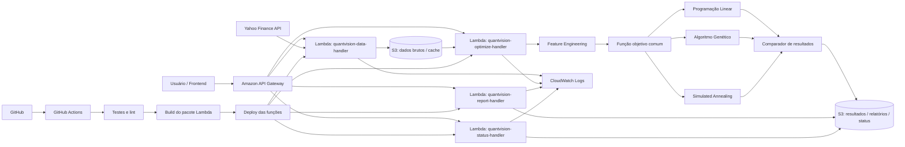
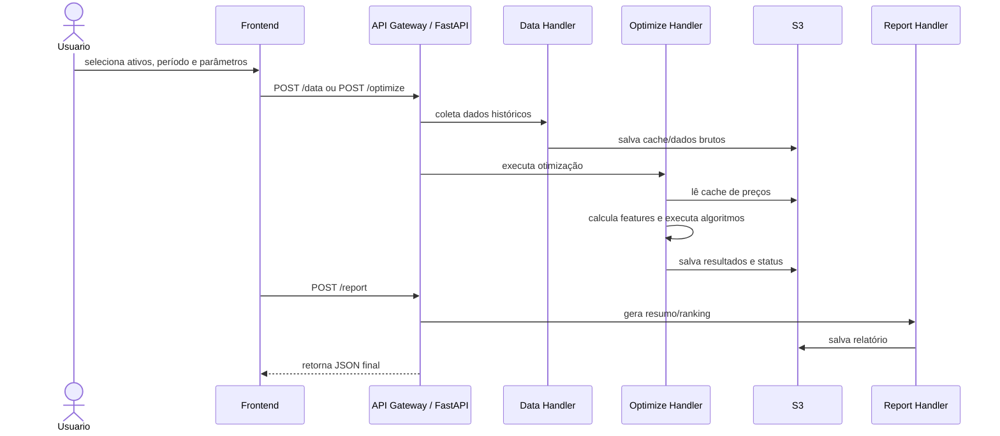
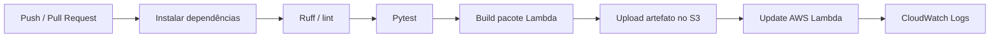

# QuantVision / Otimizador


**QuantVision** é um MVP para análise e otimização de carteiras financeiras com ativos da B3. O projeto coleta dados históricos, calcula features financeiras, executa algoritmos de otimização, compara os resultados e expõe as saídas por API, frontend web, arquivos JSON/CSV e relatórios.

> **Aviso:** este projeto tem finalidade educacional, técnica e experimental. Ele não representa recomendação de investimento, consultoria financeira ou promessa de rentabilidade.

---

## Sumário

- [Visão geral](#visão-geral)
- [Principais funcionalidades](#principais-funcionalidades)
- [Arquitetura](#arquitetura)
- [Fluxo ponta a ponta](#fluxo-ponta-a-ponta)
- [Algoritmos implementados](#algoritmos-implementados)
- [Estrutura do projeto](#estrutura-do-projeto)
- [Pré-requisitos](#pré-requisitos)
- [Como executar localmente](#como-executar-localmente)
- [API](#api)
- [Exemplo de saída JSON](#exemplo-de-saída-json)
- [Variáveis de ambiente](#variáveis-de-ambiente)
- [Testes](#testes)
- [CI/CD com GitHub Actions](#cicd-com-github-actions)
- [Deploy AWS](#deploy-aws)
- [Armazenamento no S3](#armazenamento-no-s3)
- [Roadmap](#roadmap)
- [Limitações conhecidas](#limitações-conhecidas)

---

## Visão geral

O QuantVision recebe uma lista de ativos, coleta preços históricos via Yahoo Finance, calcula retorno, risco e covariância, executa três técnicas de otimização usando a mesma função objetivo e compara qual abordagem gerou a melhor carteira segundo uma métrica de retorno ajustado ao risco.

O foco do projeto é demonstrar uma cadeia completa de produto de dados:

1. coleta de dados financeiros;
2. cache local e cache em S3;
3. processamento e feature engineering;
4. modelagem de função objetivo;
5. execução de algoritmos matemáticos;
6. comparação de resultados;
7. exposição por API e frontend;
8. automação com GitHub Actions;
9. deploy em AWS Lambda e API Gateway.

---

## Principais funcionalidades

- Download de preços históricos de ativos da B3 com `yfinance`.
- Cache local em CSV para reduzir dependência de rede.
- Cache opcional em Amazon S3 para ambiente AWS Lambda.
- Cálculo de retornos, volatilidade, matriz de covariância e métricas de risco.
- Execução de três abordagens de otimização:
  - programação linear / abordagem linear leve;
  - algoritmo genético;
  - simulated annealing.
- Comparação padronizada dos resultados.
- Saída em JSON e CSV.
- API local com FastAPI.
- Handlers preparados para AWS Lambda.
- API Gateway com rotas REST/HTTP.
- Monitoramento por CloudWatch Logs.
- CI/CD com GitHub Actions.
- Armazenamento principal em S3.

---

## Arquitetura

A arquitetura é organizada em camadas para manter separação de responsabilidades e facilitar evolução.



### Camadas do código

| Camada | Responsabilidade | Diretório sugerido |
|---|---|---|
| `domain` | Modelos, contratos, schema de saída e função objetivo | `src/otimizador/domain` |
| `data` | Ingestão, cache e feature engineering | `src/otimizador/data` |
| `algorithms` | Implementação dos algoritmos de otimização | `src/otimizador/algorithms` |
| `application` | Orquestração ponta a ponta do experimento | `src/otimizador/application.py` |
| `evaluation` | Comparação, ranking, exports e relatórios | `src/otimizador/evaluation` |
| `infrastructure` | API local, handlers Lambda e helpers HTTP | `src/otimizador/infrastructure` |
| `frontend` | Interface web estática | `frontend/` |
| `tests` | Testes unitários e de integração leve | `tests/` |

---

## Fluxo ponta a ponta



Etapas principais:

1. O usuário informa tickers, período, intervalo, peso máximo e aversão a risco.
2. A camada de dados baixa preços históricos via Yahoo Finance.
3. O sistema grava cache local ou cache em S3.
4. A etapa de features calcula retornos, volatilidade e matriz de covariância.
5. A aplicação executa os algoritmos com a mesma função objetivo.
6. Cada algoritmo retorna pesos normalizados, retorno esperado, valor objetivo, tempo de execução e metadados.
7. O comparador monta ranking e define o melhor resultado.
8. A saída pode ser exibida no frontend, retornada por API ou exportada em JSON/CSV/PDF.

---

## Algoritmos implementados

| Algoritmo | Nome no sistema | Descrição | Uso no MVP |
|---|---|---|---|
| Programação Linear / abordagem linear leve | `linear_programming` | Estratégia determinística para alocação conforme retorno ajustado e restrições simples | Baseline rápido e interpretável |
| Algoritmo Genético | `genetic_algorithm` ou `genetic` | População, seleção, elite, crossover e mutação | Busca estocástica e exploração do espaço de soluções |
| Simulated Annealing | `simulated_annealing` | Perturbação gradual dos pesos com aceitação probabilística | Busca probabilística com escape de ótimos locais |

Todos os algoritmos devem consumir a mesma entrada e retornar o mesmo formato de saída. O normalizador de pesos impede pesos negativos, força soma igual a `1` e respeita o limite de peso máximo por ativo quando essa restrição está habilitada.

---

## Função objetivo

A função objetivo padrão segue a lógica de **retorno ajustado ao risco**:

```text
score = retorno_esperado_da_carteira - penalidade_de_risco
```

Conceitualmente, o sistema recompensa maior retorno esperado e penaliza risco conforme o parâmetro `risk_aversion`.

Esse desenho permite trocar a função objetivo futuramente sem reescrever os algoritmos. Exemplos de evolução:

- maximização de Sharpe;
- minimização de volatilidade;
- controle de drawdown;
- otimização multiobjetivo;
- restrições por setor, liquidez ou concentração.

---

## Estrutura do projeto

```text
otimizador/
├── .github/
│   └── workflows/
│       └── ci-cd-lambda.yml
├── docs/
│   ├── figures/
│   ├── reports/
│   └── infrastructure.template.yaml
├── examples/
│   └── exports/
├── frontend/
│   └── index.html
├── scripts/
│   ├── run_local_experiment.py
│   ├── generate_pdf_report.py
│   └── package_lambda.py
├── src/
│   └── otimizador/
│       ├── algorithms/
│       ├── data/
│       ├── domain/
│       ├── evaluation/
│       ├── infrastructure/
│       └── application.py
├── tests/
├── requirements.txt
├── requirements-dev.txt
└── README.md
```

---

## Pré-requisitos

- Python 3.11 ou superior.
- Git.
- Conta AWS, somente para deploy cloud.
- AWS CLI configurado, somente para deploy cloud.
- Opcional: SAM CLI, caso use o template `docs/infrastructure.template.yaml`.

---

## Como executar localmente

### 1. Clonar o repositório

```bash
git clone https://github.com/<seu-usuario>/otimizador.git
cd otimizador
```

### 2. Criar ambiente virtual

#### Windows / PowerShell

```powershell
python -m venv .venv
.\.venv\Scripts\activate
pip install -r requirements.txt -r requirements-dev.txt
```

#### Linux / macOS

```bash
python -m venv .venv
source .venv/bin/activate
pip install -r requirements.txt -r requirements-dev.txt
```

### 3. Configurar `PYTHONPATH`

#### Windows / PowerShell

```powershell
$env:PYTHONPATH='src'
```

#### Linux / macOS

```bash
export PYTHONPATH=src
```

### 4. Executar experimento local

```powershell
python scripts/run_local_experiment.py `
  --symbols PETR4.SA,VALE3.SA,ITUB4.SA `
  --start-date 2015-01-01 `
  --end-date 2025-12-31 `
  --interval 1d `
  --max-weight 0.6
```

### 5. Subir API local

```powershell
python -m uvicorn otimizador.infrastructure.local_api:app --host 0.0.0.0 --port 8000 --reload
```

A API local ficará disponível em:

```text
http://localhost:8000
```

### 6. Subir frontend estático

```bash
cd frontend
python -m http.server 8080
```

Frontend local:

```text
http://localhost:8080
```

---

## API

### Rotas principais planejadas para API Gateway

| Método | Rota | Descrição |
|---|---|---|
| `POST` | `/data` | Coleta ou prepara dados financeiros |
| `POST` | `/optimize` | Executa um algoritmo específico ou todos os algoritmos |
| `POST` | `/report` | Gera ranking, resumo ou relatório a partir dos resultados |
| `GET` | `/status/{execution_id}` | Consulta status ou resultado salvo no S3 |

### Rotas comuns na API local FastAPI

| Método | Rota | Descrição |
|---|---|---|
| `GET` | `/status` | Healthcheck local |
| `POST` | `/optimize` | Executa otimização |
| `POST` | `/export` | Executa experimento e exporta JSON/CSV |
| `POST` | `/report/pdf` | Gera relatório PDF |

---

## Exemplos de payload

### `POST /optimize`

```json
{
  "symbols": ["PETR4.SA", "VALE3.SA", "ITUB4.SA"],
  "start_date": "2015-01-01",
  "end_date": "2025-12-31",
  "interval": "1d",
  "algorithm": "all",
  "max_weight": 0.6,
  "risk_aversion": 1.0,
  "seed": 42
}
```

### Executar apenas algoritmo genético

```json
{
  "symbols": ["PETR4.SA", "VALE3.SA", "ITUB4.SA"],
  "period": "5y",
  "interval": "1d",
  "algorithm": "genetic_algorithm",
  "max_weight": 0.6,
  "risk_aversion": 1.0,
  "seed": 42
}
```

### Executar programação linear

```json
{
  "symbols": ["PETR4.SA", "VALE3.SA", "ITUB4.SA"],
  "period": "5y",
  "interval": "1d",
  "algorithm": "linear_programming",
  "max_weight": 0.6,
  "risk_aversion": 1.0
}
```

### Executar simulated annealing

```json
{
  "symbols": ["PETR4.SA", "VALE3.SA", "ITUB4.SA"],
  "period": "5y",
  "interval": "1d",
  "algorithm": "simulated_annealing",
  "max_weight": 0.6,
  "risk_aversion": 1.0,
  "seed": 42
}
```

---

## Exemplo de saída JSON

```json
{
  "execution_id": "2b7d5b3f-5a6c-4f7e-a3a2-2aef3c8b59d1",
  "status": "SUCCEEDED",
  "request": {
    "symbols": ["PETR4.SA", "VALE3.SA", "ITUB4.SA"],
    "interval": "1d",
    "max_weight": 0.6,
    "risk_aversion": 1.0
  },
  "winner": "genetic_algorithm",
  "ranking": [
    {
      "position": 1,
      "algorithm": "genetic_algorithm",
      "objective_value": 0.00182
    },
    {
      "position": 2,
      "algorithm": "simulated_annealing",
      "objective_value": 0.00175
    },
    {
      "position": 3,
      "algorithm": "linear_programming",
      "objective_value": 0.00143
    }
  ],
  "results": [
    {
      "algorithm": "genetic_algorithm",
      "objective_value": 0.00182,
      "expected_return": 0.00231,
      "volatility": 0.0187,
      "sharpe_ratio": 0.1235,
      "weights": {
        "PETR4.SA": 0.38,
        "VALE3.SA": 0.34,
        "ITUB4.SA": 0.28
      },
      "elapsed_ms": 184.52,
      "metadata": {
        "population_size": 40,
        "generations": 200,
        "seed": 42
      }
    }
  ]
}
```

---

## Variáveis de ambiente

| Variável | Descrição | Exemplo |
|---|---|---|
| `OTIMIZADOR_SYMBOL` | Ativo único padrão | `PETR4.SA` |
| `OTIMIZADOR_SYMBOLS` | Lista de ativos separados por vírgula | `PETR4.SA,VALE3.SA,ITUB4.SA` |
| `OTIMIZADOR_PERIOD` | Período usado quando não há datas explícitas | `5y` |
| `OTIMIZADOR_START_DATE` | Data inicial | `2015-01-01` |
| `OTIMIZADOR_END_DATE` | Data final | `2025-12-31` |
| `OTIMIZADOR_INTERVAL` | Intervalo dos preços | `1d` |
| `OTIMIZADOR_CACHE_DIR` | Diretório de cache local | `cache/` ou `/tmp/cache` |
| `OTIMIZADOR_RISK_AVERSION` | Penalidade de risco na função objetivo | `1.0` |
| `OTIMIZADOR_MAX_WEIGHT` | Peso máximo por ativo | `0.6` |
| `OTIMIZADOR_RANDOM_SEED` | Seed para reprodutibilidade | `42` |
| `OTIMIZADOR_GA_POPULATION` | Tamanho da população do algoritmo genético | `40` |
| `OTIMIZADOR_GA_GENERATIONS` | Número de gerações do algoritmo genético | `200` |
| `OTIMIZADOR_SA_ITERATIONS` | Iterações do simulated annealing | `200` |
| `OTIMIZADOR_SA_TEMPERATURE` | Temperatura inicial do simulated annealing | `1.0` |
| `OTIMIZADOR_SA_COOLING_RATE` | Taxa de resfriamento | `0.98` |
| `OTIMIZADOR_S3_BUCKET` | Bucket principal do projeto | `quantvision-data-bucket` |
| `OTIMIZADOR_S3_CACHE_PREFIX` | Prefixo do cache de preços | `cache/` |
| `OTIMIZADOR_S3_RESULTS_PREFIX` | Prefixo dos resultados | `results/` |
| `OTIMIZADOR_S3_REPORTS_PREFIX` | Prefixo dos relatórios | `reports/` |
| `OTIMIZADOR_ALLOW_SYNTHETIC_DATA` | Permite dados sintéticos em fallback | `false` |

---

## Testes

Executar todos os testes:

```powershell
$env:PYTHONPATH='src'
pytest -q
```

Ou no Linux/macOS:

```bash
export PYTHONPATH=src
pytest -q
```

Áreas cobertas pelos testes:

- algoritmos;
- features;
- ingestão e cache;
- comparação de resultados;
- exportação;
- handlers Lambda;
- API local.

---

## CI/CD com GitHub Actions

O projeto usa GitHub Actions para automação de qualidade e deploy.

Fluxo recomendado:



Secrets esperados no GitHub:

| Secret | Uso |
|---|---|
| `AWS_ACCESS_KEY_ID` | Credencial para deploy |
| `AWS_SECRET_ACCESS_KEY` | Credencial para deploy |
| `AWS_REGION` | Região AWS, ex.: `us-east-2` ou `sa-east-1` |
| `AWS_S3_DEPLOY_BUCKET` | Bucket para artefatos de deploy |
| `LAMBDA_DATA_HANDLER` | Nome da Lambda de dados |
| `LAMBDA_OPTIMIZE_HANDLER` | Nome da Lambda de otimização |
| `LAMBDA_REPORT_HANDLER` | Nome da Lambda de relatório |
| `LAMBDA_STATUS_HANDLER` | Nome da Lambda de status |

Funções Lambda sugeridas:

```text
quantvision-data-handler
quantvision-optimize-handler
quantvision-report-handler
quantvision-status-handler
```

---

## Deploy AWS

Arquitetura cloud proposta:

| Componente | Papel |
|---|---|
| API Gateway | Entrada HTTP pública para os endpoints |
| AWS Lambda | Execução dos handlers de dados, otimização, relatório e status |
| Amazon S3 | Armazenamento de dados brutos, cache, resultados, relatórios e status |
| CloudWatch Logs | Logs, diagnóstico e observabilidade |
| GitHub Actions | Pipeline de testes, build e deploy |

### Rotas API Gateway

| Método | Rota | Lambda |
|---|---|---|
| `POST` | `/data` | `quantvision-data-handler` |
| `POST` | `/optimize` | `quantvision-optimize-handler` |
| `POST` | `/report` | `quantvision-report-handler` |
| `GET` | `/status/{execution_id}` | `quantvision-status-handler` |

### Permissões mínimas da role Lambda

A role das Lambdas deve ter permissão para:

- escrever logs no CloudWatch;
- ler e escrever objetos no bucket S3 do projeto;
- opcionalmente consultar Step Functions, caso o fluxo assíncrono seja usado futuramente.

Exemplo conceitual de permissões:

```json
{
  "Version": "2012-10-17",
  "Statement": [
    {
      "Effect": "Allow",
      "Action": [
        "logs:CreateLogGroup",
        "logs:CreateLogStream",
        "logs:PutLogEvents"
      ],
      "Resource": "*"
    },
    {
      "Effect": "Allow",
      "Action": [
        "s3:GetObject",
        "s3:PutObject",
        "s3:ListBucket"
      ],
      "Resource": [
        "arn:aws:s3:::SEU_BUCKET",
        "arn:aws:s3:::SEU_BUCKET/*"
      ]
    }
  ]
}
```

---

## Armazenamento no S3

O projeto não depende de DynamoDB no MVP. A persistência principal pode ser feita em S3.

Estrutura sugerida:

```text
s3://quantvision-data-bucket/
├── data/
│   ├── raw/
│   └── cache/
├── results/
│   └── <execution_id>/result.json
├── reports/
│   └── <execution_id>/report.pdf
├── status/
│   └── <execution_id>.json
└── deploy/
    └── lambda-package.zip
```

Uso sugerido por rota:

| Rota | Entrada | Saída no S3 |
|---|---|---|
| `/data` | Tickers e janela de datas | `data/raw/` e `data/cache/` |
| `/optimize` | Parâmetros de otimização | `results/<execution_id>/result.json` e `status/<execution_id>.json` |
| `/report` | `execution_id` ou resultados | `reports/<execution_id>/` |
| `/status/{execution_id}` | ID da execução | Lê `status/<execution_id>.json` |

---

## Observabilidade

Cada handler Lambda deve registrar logs úteis no CloudWatch:

- `execution_id`;
- rota chamada;
- ativos recebidos;
- algoritmo selecionado;
- tempo de execução;
- erros de ingestão;
- caminho S3 dos resultados.

Exemplo de log esperado:

```text
[INFO] execution_id=abc-123 route=/optimize algorithm=genetic_algorithm symbols=PETR4.SA,VALE3.SA elapsed_ms=184.52
```

---

## Roadmap

- [ ] Consolidar frontend oficial.
- [ ] Padronizar nomes dos algoritmos no payload e nos resultados.
- [ ] Adicionar backtesting com curva de capital e drawdown.
- [ ] Adicionar novos algoritmos, como Markowitz, Black-Litterman, Monte Carlo e NSGA-II.
- [ ] Melhorar relatório PDF com gráficos comparativos.
- [ ] Criar dashboard hospedado em S3 + CloudFront.
- [ ] Evoluir status assíncrono com Step Functions, mantendo S3 como armazenamento.
- [ ] Adicionar autenticação no API Gateway.
- [ ] Criar documentação detalhada em `docs/arquitetura.md`.

---

## Limitações conhecidas

- A disponibilidade do Yahoo Finance pode variar; por isso o cache CSV e o cache S3 são importantes.
- Os resultados dependem da janela histórica, do intervalo, dos ativos e da função objetivo escolhida.
- O nome `linear_programming` pode representar uma implementação leve para Lambda, não necessariamente um solver linear clássico completo.
- Em AWS Lambda, dependências como `numpy`, `pandas` e `yfinance` precisam estar no pacote `.zip` ou em uma Lambda Layer.
- Este projeto não executa ordens em corretoras e não faz trading automático.

---

## Licença

Defina a licença no arquivo `LICENSE`. Para projetos educacionais e portfólio, uma opção comum é MIT.

---

## Autor

Projeto desenvolvido por **Henrique Yuji** como MVP de engenharia quantitativa, otimização matemática e arquitetura cloud serverless.
